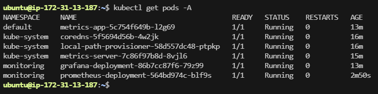
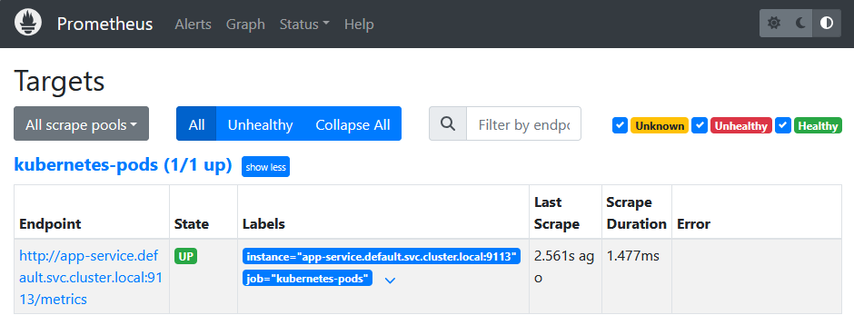
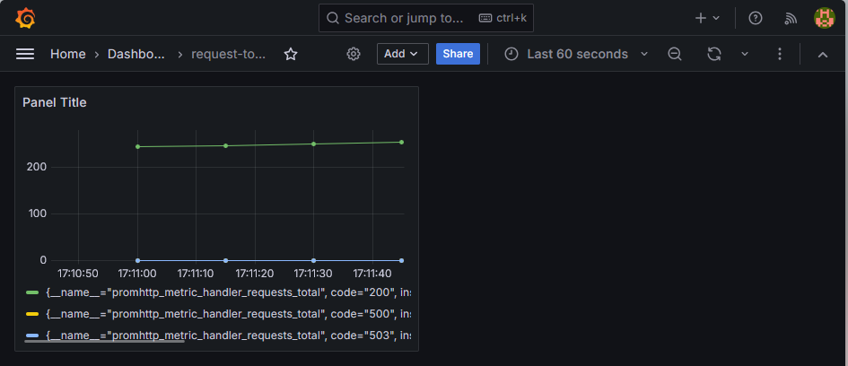

# Kubernetes Application Metrics Scrape Infrastructure with Prometheus and Grafana

Difficulty: 🟢 Easy

Primary Tools: AWS, Terraform, K3s (Lightweight Kubernetes), Prometheus, Grafana, Linux (Ubuntu), Spot Instances

Time to Complete: 2–3 hours

## 🏢 Scenario & Architectural Design

In your previous lab, you learned how two containers running inside the same Kubernetes Pod share local disk volumes and write to the same files. However, in modern cloud-native environments, checking logs inside containers by hand doesn't scale. Instead of reading log files manually, modern applications expose their internal health and performance data over HTTP as plain text variables—known as **Application Metrics**.

To collect these metrics, operations teams use a pull-based monitoring system called **Prometheus**. Prometheus continuously knocks on the door of your Kubernetes Pods, downloads their raw performance data, and stores it in a database. Then, teams connect a visual charting tool called **Grafana** to Prometheus to turn those raw text numbers into beautiful, real-time health dashboards.

In this lab, you will deploy an application container inside a K3s Kubernetes cluster running on an AWS Spot Instance. You will write a manual Prometheus configuration file from scratch to locate and scrape your application. Finally, you will install Grafana inside your cluster and configure it to read metrics from Prometheus, giving you an end-to-end look at a production-grade monitoring pipeline.

## 📐 Logical Architecture Diagram (ASCII format)

```text
       [ Your Web Browser / Laptop ]
                    │
                    ├──► Access Grafana UI Dashboard (Port 30030)
                    └──► Generate Application Web Traffic (Port 30080)
                                                                 │
┌─────────────────────────── AWS Cloud ───────────────────────────┐
│                                                                 │
│  Default VPC / Public Subnet                                    │
│  ┌─────────────────────── EC2 Instance ──────────────────────┐  │
│  │                 (t3.small / Ubuntu / Spot)                │  │
│  │                                                           │  │
│  │  [ Security Group ]                                       │  │
│  │   └── Inbound Ports: 22, 30080 (App), 30090 (Prom),       │  │
│  │                      30030 (Grafana)                      │  │
│  │                                                           │  │
│  │  [ K3s Single-Node Kubernetes Cluster ]                   │  │
│  │   ├── Namespace: monitoring                               │  │
│  │   │     ├── [ Prometheus Server Pod ] ◄────────────┐      │  │
│  │   │     │     └── Scrapes metrics over HTTP        │      │  │
│  │   │     └── [ Grafana Dashboard Pod ] ──────────┐  │      │  │
│  │   │           └── Queries metrics database      │  │      │  │
│  │   │                                             ▼  │      │  │
│  │   └── Namespace: default                        │  │      │  │
│  │         └── [ Web Application Pod ] ◄───────────┴──┴      │  │
│  │               └── Exposes raw metrics at /metrics         │  │
│  │                                                           │  │
│  └───────────────────────────────────────────────────────────┘  │
└─────────────────────────────────────────────────────────────────┘

```

## 🎯 Learning Objectives & Skill Targets

* **Cloud-Native Metrics Pull Architecture:** Understand how Prometheus discovers and scrapes application endpoints inside a cluster.
* **Writing Declarative Scrape Configurations:** Author custom Prometheus job rules by hand to read structural metrics data.
* **Visualizing Telemetry with Grafana:** Connect storage backends to Grafana and build custom data monitoring panels.
* **Kubernetes Multi-Namespace Administration:** Organize cluster infrastructure by isolating applications from logging and monitoring components.

---

## 🛠️ The Implementation Requirements

### 1. Cloud Infrastructure (Terraform & AWS)

Create your standard Terraform working directory (`main.tf`, `outputs.tf`):

* Deploy a single AWS EC2 instance running Ubuntu 24.04 LTS. Request a `t3.small` instance as an **AWS Spot Instance** (giving you 2 vCPUs and 2GB of RAM to run your monitoring tools easily for pennies per hour).
* Configure your Security Group to open inbound ports: `22` (SSH), `30080` (Web App UI), `30090` (Prometheus Dashboard), and `30030` (Grafana Dashboard).
* Use the exact same automated K3s setup script in your `user_data` property from the previous lab to ensure your instance boots with a fresh, ready-to-use Kubernetes engine.

### 2. Deploying the Metrics-Exposing Web Application

Log into your server via SSH. Create a file named `app-deployment.yaml`. You will deploy a special web application image that is pre-programmed to record how many hits it receives and output that data in a format Prometheus understands.

Write the Kubernetes manifest completely by hand:

* Define a standard `Deployment` named `metrics-app`.
* Use the public image: `nginx/nginx-prometheus-exporter:1.1.0` (This runs an Nginx proxy that converts standard logs into a Prometheus metrics feed).
* Inside the container spec, specify that the container listens on port `9113`.
* Define a `Service` named `app-service` of type `NodePort`, routing incoming external node traffic from port `30080` to the container port `9113`.

Apply it to your cluster:

```bash
kubectl apply -f app-deployment.yaml

```

### 3. Writing the Prometheus Configuration & Deployment Manually (No AI Assist)

Now, you will build the monitoring components. To learn how Prometheus targets applications, you will create its configuration file entirely by hand.

Create a file named `prometheus-config.yaml` on your server. This file acts as a Kubernetes `ConfigMap`—which is a way to inject configuration files directly into a running container:

```yaml
apiVersion: v1
kind: ConfigMap
metadata:
  name: prometheus-server-conf
  namespace: monitoring
data:
  prometheus.yml: |
    global:
      scrape_interval: 5s

    scrape_configs:
      - job_name: 'kubernetes-pods'
        static_configs:
          - targets: ['localhost:30080'] # Points to our web app's NodePort entry!

```

Next, create a file named `monitoring-stack.yaml` to deploy Prometheus and Grafana together. Write out the following infrastructure declarations:

* **The Namespace:** Create a separate namespace wrapper at the top of the file:
```yaml
apiVersion: v1
kind: Namespace
metadata:
  name: monitoring

```


* **The Prometheus Pod:** Define a deployment in the `monitoring` namespace using the image `prom/prometheus:v2.51.0`. Mount the `prometheus-server-conf` ConfigMap you created above into the container folder path `/etc/prometheus/`. Create a `Service` using `NodePort: 30090` to expose the Prometheus dashboard.
* **The Grafana Pod:** Define a deployment in the `monitoring` namespace using the image `grafana/grafana:10.4.0`. Create a `Service` using `NodePort: 30030` to expose the Grafana control panel.

Apply both monitoring manifests to your system:

```bash
kubectl apply -f prometheus-config.yaml
kubectl apply -f monitoring-stack.yaml

```

---

## 🚨 Operational Troubleshooting Inject (Live Fire Exercise)

### Failure Scenario

You apply all files to your cluster, and running `kubectl get pods -n monitoring` shows that Prometheus and Grafana are running completely healthy. You can log into your Prometheus dashboard at `http://<YOUR_EC2_IP>:30090`.

However, when you click on **Status -> Targets**, your application scrape job is flashing bright red with an error reading: `HTTP server responded with status code 404 Not Found` or `Connection Refused`. Prometheus is running fine, but it cannot collect metrics from your web application.

### Debugging Actions & Clues

When monitoring setups break, you have to track the network path step-by-step to see where the data stream is stopping. Run these troubleshooting commands inside your terminal:

1. Test what your application actually returns when you ask it for metrics locally on the node:
```bash
curl http://localhost:30080/metrics

```


2. Inspect whether the application exporter expects you to ask for data on a different web path by running a curl against the root index:
```bash
curl http://localhost:30080/

```


3. Look at your hand-written `prometheus.yml` configuration inside your ConfigMap file to check which path it is using to fetch numbers.

### Root Cause Hint

By default, Prometheus assumes that every application exposes its performance data on the web folder path `/metrics`. However, some applications or exporters output their metrics on different endpoints (such as `/ext/metrics` or require specific query arguments). If you curl your application on port `30080` and notice it returns a page listing metrics *only* when you explicitly type an alternative sub-path, you must update your `prometheus.yml` configuration block inside your ConfigMap to add a specific `metrics_path: "/your-correct-path"` instruction line so Prometheus knows exactly where to look.

---

## ✅ Acceptance Criteria & Proof of Success

### Kubernetes Pod Verification

Verify that your separate application and infrastructure components are all running inside their designated namespaces:

```bash
kubectl get pods -A

```

**Expected Output Snippet:**

```text
NAMESPACE    NAME                            READY   STATUS    RESTARTS
default      metrics-app-xxxxxxxx-xxxx       1/1     Running   0
monitoring   prometheus-xxxxxxxx-xxxx        1/1     Running   0
monitoring   grafana-xxxxxxxx-xxxx           1/1     Running   0

```
Output: \



### Prometheus Target Verification

Open your web browser and navigate to `http://<YOUR_EC2_PUBLIC_IP>:30090`. Click on the **Status** menu and select **Targets**. Your `kubernetes-pods` scrape entry must display a green **UP** state indicator, proving your configuration successfully located and read your container metrics.

Output: \


### Grafana Visualization Setup

1. Open your web browser and navigate to your Grafana endpoint at `http://<YOUR_EC2_PUBLIC_IP>:30030` (Log in using the default username `admin` and password `admin`).
2. Navigate to **Connections -> Data Sources**, click **Add data source**, choose **Prometheus**, and set the connection URL to point to your Prometheus instance endpoint: `http://localhost:30090` (or its internal cluster service address). Click **Save & Test**.
3. Create a new dashboard panel and input a test Prometheus query variable such as `promhttp_metric_handler_requests_total` or `up`. You should see a real-time graph line tracking your metrics data perfectly on your screen.

Output: \


---

## 🧹 Cost-Aware Clean Up Process

1. To avoid any unexpected charges outside of your free tiers, make sure to completely tear down your cloud resources immediately after you finish testing by executing this command in your local terminal workspace:
```bash
terraform destroy -auto-approve

```


2. Log into your cloud provider web console dashboard and double-check your active **Spot Requests** page to confirm that your computing server has been completely terminated.
