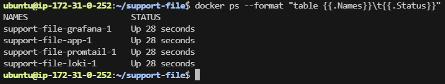
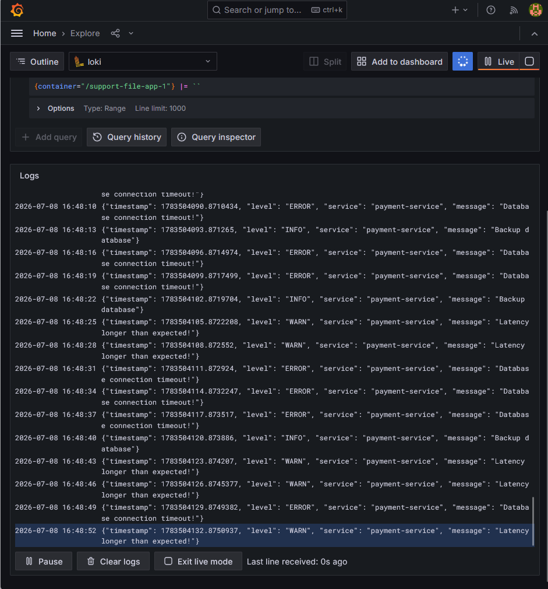

# Containerized Log Aggregation with Grafana Loki and Hand-Written Python Log Injector

Difficulty: 🟢 Easy

Primary Tools: AWS, Terraform, Docker, Docker Compose, Grafana Loki, Promtail, Python

Time to Complete: 2–3 hours

## 🏢 Scenario & Architectural Design

In your previous monitoring lab, you learned how Prometheus *scrapes metrics* (numerical values like CPU usage or hit counts). But numbers only tell you *when* something is broken; they don't tell you *why*. For that, you need to look at application logs (text strings showing stack traces, database connection errors, or user actions).

In a containerized company, you can't just SSH into 50 different machines to run `docker logs` or read text files. You need a centralized system that sucks up logs from every container and streams them into a single database. The modern enterprise standard for this is the **PLG Stack (Prometheus, Loki, Promtail, Grafana)**.

* **Promtail** is an agent that sits on your server, grabs logs from your Docker containers, and ships them away.
* **Grafana Loki** is a datastore optimized specifically to hold massive amounts of text logs efficiently.
* **Grafana** acts as the front-end browser where you query those logs.

In this scenario, you will provision a low-cost AWS Spot Instance. You will set up Loki and Promtail inside Docker Compose. To learn how log parsing actually works under the hood, you will write a custom **Python Script entirely by hand** that acts as an application generating simulated error logs, and verify that those logs successfully stream into your Loki dashboard.

## 📐 Logical Architecture Diagram (ASCII format)

```text
       [ Your Web Browser / Laptop ]
                    │
                    └──► Access Grafana UI Log Explorer (Port 3000)
                                                                 
┌─────────────────────────── AWS Cloud ───────────────────────────┐
│                                                                 │
│  Default VPC / Public Subnet                                    │
│  ┌─────────────────────── EC2 Instance ──────────────────────┐  │
│  │                 (t3.micro or t3.small / Spot)             │  │
│  │                                                           │  │
│  │  [ Security Group ]                                       │  │
│  │   └── Inbound Ports: 22 (SSH), 3000 (Grafana Web UI)      │  │
│  │                                                           │  │
│  │  [ Docker Container Engine Runtime ]                      │  │
│  │   ├── Container 1: [ Python Log Generator ]               │  │
│  │   │     └── Writes custom JSON text logs out to stdout    │  │
│  │   │                                                       │  │
│  │   ├── Container 2: [ Promtail Agent Container ]           │  │
│  │   │     └── Sucks logs out of Docker engine sock ─────────┼──┐
│  │   │                                                       │  │
│  │   ├── Container 3: [ Grafana Loki Log DB Engine ] ◄───────┘  │
│  │   │     └── Indexes and saves log strings                 │  │
│  │   │                                                       │  │
│  │   └── Container 4: [ Grafana Visual Panel UI ]            │  │
│  │         └── Queries Loki to display live logs             │  │
│  │                                                           │  │
│  └───────────────────────────────────────────────────────────┘  │
└─────────────────────────────────────────────────────────────────┘

```

## 🎯 Learning Objectives & Skill Targets

* **Centralized Log Management Architecture:** Understand the mechanics of log aggregation using Promtail agents and Loki datastores.
* **Production-Ready Python Automation:** Write structural log scripts to simulate real-world microservice runtime telemetry.
* **LogQL Component Querying:** Master Grafana's Log Query Language (LogQL) to isolate errors, filter text strings, and search across stream labels.
* **Docker Socket Mapping:** Mount system-level runtimes (`/var/lib/docker/containers`) inside container bounds to allow monitoring tools to read data.

---

## 🛠️ The Implementation Requirements

### 1. Cloud Infrastructure (Terraform & AWS)

Create a clean directory structure containing your standard Terraform template assets (`main.tf`, `outputs.tf`):

* Map out a single AWS EC2 instance running Ubuntu 24.04 LTS configured as an **AWS Spot Instance** (`t3.micro` or `t3.small`) to keep resource spending to pennies.
* Define an attached Security Group exposing only two access doors: Inbound TCP Port `22` (for your terminal workspace) and Inbound TCP Port `3000` (to open the web-based Grafana Dashboard panel).
* Attach a `user_data` script to automatically install Docker and Docker Compose when the node spins up, so you can immediately work with containers upon logging in.

### 2. Manual Python Log Generator Script (No AI Assist)

To practice the scripting languages required in day-to-day DevOps roles, write a Python file named `log_generator.py` completely by hand. Do not let an AI write this line-by-line.

Your script must implement the following behavior:

1. Imports the standard `time`, `json`, `random`, and `sys` modules.
2. Creates an infinite loop (`while True:`) that triggers every 3 seconds.
3. Inside the loop, dynamically selects a random log level status string from an array: `["INFO", "WARN", "ERROR"]`.
4. Constructs a structured message dictionary containing: a timestamp, the selected log level, a microservice name label (e.g., `"payment-service"`), and a message string (e.g., if the level is ERROR, write `"Database connection timeout!"`, otherwise write `"Transaction processed safely"`).
5. Uses `json.dumps()` to format that dictionary into a single line of raw JSON text and prints it directly to standard output using `print()`. Ensure you use `sys.stdout.flush()` right after printing so the Docker engine catches the stream instantly without buffering!

Wrap this script inside a simple `Dockerfile` that packages your script onto a lightweight `python:3.11-slim` base image and runs it using `CMD ["python", "-u", "log_generator.py"]`.

### 3. Orchestrating the Logging Stack (Docker Compose)

Create a single orchestration manifest file named `docker-compose.yml` to stitch your logging environment together. Your compose file will configure four separate services running on the same network layer:

* **`loki`**: Uses the official container image `grafana/loki:2.9.0`. Exposes internal database communication port `3100`.
* **`promtail`**: Uses image `grafana/promtail:2.9.0`. Crucially, you must mount the host machine's internal Docker container paths into this container so it can find everyone's logs:
```yaml
volumes:
  - /var/lib/docker/containers:/var/lib/docker/containers:ro
  - ./promtail-config.yaml:/etc/promtail/config.yml

```


* **`grafana`**: Uses image `grafana/grafana:10.4.0`. Exposes port `3000:3000` to your public network.
* **`app`**: Builds and runs your custom Python log application container.

To configure your Promtail agent to discover your containers, create a small companion configuration file named `promtail-config.yaml` in the same directory:

```yaml
server:
  http_listen_port: 9080

positions:
  filename: /tmp/positions.yaml

clients:
  - url: http://loki:3100/loki/api/v1/push

scrape_configs:
  - job_name: docker_logs
    docker_sd_configs:
      - host: unix:///var/run/docker.sock
        refresh_interval: 5s
    relabel_configs:
      - source_labels: ['__meta_docker_container_name']
        target_label: 'container'

```

Launch the entire system on your cloud machine:

```bash
docker-compose up --build -d

```

---

## 🚨 Operational Troubleshooting Inject (Live Fire Exercise)

### Failure Scenario

You successfully run your docker composition environment. All four containers show an `Up` status when running `docker ps`. You log into your Grafana web board on port `3000`, add your Loki data source, and jump into the log explorer.

However, when you search for logs, the screen is blank. It returns an error message or a warning saying: `No data sources found` or `Loki label discovery timeout`. Promtail is running, but it isn't successfully extracting logs from your Python application container.

### Debugging Actions & Clues

When log streams are missing, you have to find out if the application isn't writing them, or if the collector agent doesn't have permissions to read them. Execute these commands on your EC2 host terminal:

1. Confirm that your custom Python script is actually outputting text to the Docker runtime logs:
```bash
docker logs <your_python_app_container_id>

```


2. Inspect the internal runtime log logs of the Promtail collector agent container to look for permission dropouts:
```bash
docker logs <your_promtail_container_id>

```


3. Check the execution group permissions on your host machine's Docker socket path:
```bash
ls -la /var/run/docker.sock

```


### Root Cause Hint

Look closely at the Promtail logging errors inside its container console. If you see messages like `Permission denied` or `Failed to connect to docker socket`, look at how Promtail interacts with your system. Promtail needs access to `unix:///var/run/docker.sock` to read live container names and labels metadata. If your `docker-compose.yml` does not explicitly pass the `/var/run/docker.sock` file from your host machine into your Promtail container via a volume mount, the agent will have no way to trace which logs belong to your Python container!

---

## ✅ Acceptance Criteria & Proof of Success

### Container Runtime Verification

Verify that your log generation script and your telemetry storage stack components are all operating stably in the background:

```bash
docker ps --format "table {{.Names}}\t{{.Status}}"

```

**Expected Output:**

```text
NAMES               STATUS
project_app_1       Up 15 minutes
project_promtail_1  Up 15 minutes
project_loki_1      Up 15 minutes
project_grafana_1   Up 15 minutes

```

Output: \


### LogQL Stream and Query Verification

1. Open your web browser and load your Grafana engine console at `http://<YOUR_EC2_IP>:3000` (Log in using default `admin` / `admin`).
2. Navigate to **Connections -> Data Sources**, click **Add data source**, choose **Loki**, and set its target URL to point to your Loki container internal database service address: `http://loki:3100`. Save and test.
3. Click **Explore** in your Grafana sidebar menu, switch the data source drop-down to **Loki**, and write a native LogQL query into the stream target search line to filter only for your container name:
```text
{container="project_app_1"}

```


4. Click **Run Query**. Your browser screen must immediately populate with your raw JSON system strings generated by your hand-written Python loop script, displaying your custom `INFO`, `WARN`, and `ERROR` objects in real-time.

---

Output: \


## 🧹 Cost-Aware Clean Up Process

1. To avoid any background infrastructure billings appearing on your account, tear down your testing sandbox environment using your local laptop terminal:
```bash
terraform destroy -auto-approve

```


2. Refresh your web cloud console to guarantee that your low-cost AWS Spot instance and storage disks are entirely deleted.
