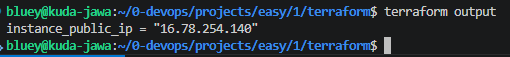
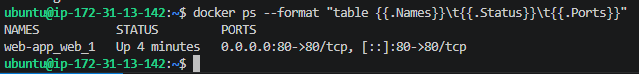
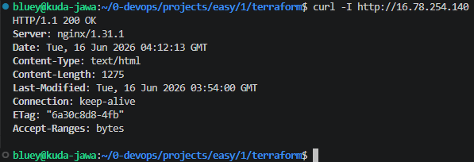

# Automated Single-Instance Web Application with Docker Compose and GitHub Actions

Difficulty: 🟢 Easy

Primary Tools: AWS, Terraform, Docker, Docker Compose, GitHub Actions, Linux (Ubuntu)

Estimated Cost: ~$0.015 per hour (~$0.05 total for a 3-hour lab using AWS On-Demand Instances)

Time to Complete: 2–3 hours

## 🏢 Scenario & Architectural Design
When starting out in a DevOps or CloudOps role, companies rarely expect you to manage massive, multi-region Kubernetes clusters on day one. Instead, the most valuable skills you can master are Infrastructure as Code (IaC), Containerization, and CI/CD Pipelines. The bread-and-butter of day-to-day operations often involves taking a developer's application, wrapping it in a container, and deploying it automatically to a cloud server.

In this scenario, your team needs to deploy a simple, containerized web application to a staging environment. Instead of configuring the server by hand, you will write a Terraform script to provision a low-cost AWS EC2 instance. Because your AWS Free Tier has expired, you will configure Terraform to request a highly predictable On-Demand instance, minimizing infrastructure disruption risks while keeping total operational costs under ten cents for the duration of the project.

Once the infrastructure is live, you will set up a GitHub Actions pipeline that automatically builds a custom Docker image of your web application, pushes it to your server, and uses Docker Compose to launch the application seamlessly.

## 📐 Logical Architecture Diagram (ASCII format)

```text
  [ Developer ] ───► Git Push ───► [ GitHub Repository ]
                                            │
                                            ▼
                                   [ GitHub Actions ]
                               (Builds & Deploys via SSH)
                                            │
                                            ▼
┌─────────────────────────── AWS Cloud ───────────────────────────┐
│                                                                 │
│  Default VPC / Public Subnet                                    │
│  ┌─────────────────────── EC2 Instance ──────────────────────┐  │
│  │               (t3.micro / Ubuntu / On-Demand)             │  │
│  │                                                           │  │
│  │  [ Security Group ]                                       │  │
│  │   └── Inbound: 22 (SSH), 80 (HTTP)                        │  │
│  │                                                           │  │
│  │  [ Docker Container Runtime Engine ]                      │  │
│  │   └── [ Docker Compose Project ]                          │  │
│  │        └── Web App Container (Listening on Port 80)       │  │
│  │                                                           │  │
│  └───────────────────────────────────────────────────────────┘  │
└─────────────────────────────────────────────────────────────────┘

```

## 🎯 Learning Objectives & Skill Targets

* **Predictable Infrastructure:** Write deterministic Terraform configuration files to provision predictable On-Demand cloud compute resources.
* **Container Fundamentals:** Package an application into a lightweight, portable Docker container image.
* **Multi-Container Orchestration:** Use Docker Compose to manage container variables and port mappings declaratively.
* **Production CI/CD:** Build an automated GitHub Actions pipeline that securely communicates with a cloud server using SSH keys.

##  🛠️ The Implementation Requirements

### 1. Cloud Infrastructure (Terraform & AWS)

Create a clean directory containing your Terraform files (`main.tf`, `outputs.tf`). Your configuration must include:

* **The Provider:** Configure the AWS provider targeting your preferred region (e.g., `us-east-1` or `us-west-2`).
* **Instance Type:** Configure your `aws_instance` resource to utilize a `t3.micro` instance type running standard On-Demand capacity. Do not include any `instance_market_options` blocks.
* **Security Group:** Expose inbound TCP Port `22` (restricted to your local public IP address for security) and inbound TCP Port `80` (open to `0.0.0.0/0` so you can view your web application).

### 2. Server Bootstrapping (User Data)

To ensure the server is ready to run containers immediately upon creation, attach a startup script using the `user_data` property in Terraform. This script will automate the installation of Docker and Docker Compose when the Ubuntu instance boots up:

```bash
#!/bin/bash
sudo apt-get update -y
sudo apt-get install -y docker.io docker-compose
sudo systemctl start docker
sudo systemctl enable docker
# Allow the default ubuntu user to run docker commands without sudo
sudo usermod -aG docker ubuntu

```

### 3. Application & Docker Setup

Create a simple directory structure in your GitHub repository holding your web assets:

* **`index.html`**: Write a basic HTML landing page greeting your visitors.
* **`Dockerfile`**: Use the official, lightweight Nginx image to serve your static file:
```dockerfile
FROM nginx:alpine
COPY index.html /usr/share/nginx/html/index.html

```


* **`docker-compose.yml`**: Create a compose configuration that maps incoming traffic on host port `80` directly to the container's internal web server port `80`:
```yaml
version: '3.8'
services:
  web:
    build: .
    ports:
      - "80:80"
    restart: always

```


### 4. CI/CD Pipeline (GitHub Actions)

Create a workflow file at `.github/workflows/deploy.yml` in your repository. The automation pipeline should perform the following actions whenever code is pushed to your `main` branch:

1. Check out the repository code.
2. Log into your EC2 server securely using an SSH action.
3. Pull the updated repository files onto the instance.
4. Execute `docker-compose up --build -d` directly on the server to automatically build your custom container image and restart the web application in the background.

> 🔒 **Security Note:** Never save your infrastructure credentials or SSH keys in plain text within your repository code. Navigate to your GitHub Repository Settings -> Secrets and Variables -> Actions, and safely store your `EC2_HOST` (your instance's public IP address) and `EC2_SSH_PRIVATE_KEY`.

## 🚨 Operational Troubleshooting Inject (Live Fire Exercise)

#### Failure Scenario

You push your code to GitHub, and the Actions workflow executes successfully with a green checkmark. However, when you browse to your EC2 instance's public IP address, the web page loads an empty white screen displaying a `502 Bad Gateway` or a standard Nginx error page instead of your custom HTML.

#### Debugging Commands & Clues

Log into your EC2 server via your command-line terminal to investigate the operational state of your runtime system:

1. Check whether your custom container application is actually up and running:
```bash
docker ps

```


2. Check the active network port binds to see exactly which application is grabbing traffic on port `80`:
```bash
sudo ss -tulnp | grep :80

```


3. Read the live application logs streaming inside your Docker container engine:
```bash
docker-compose logs web

```


#### Root Cause Hint

If the container engine shows that the default Nginx welcome page is overriding your file, check your `Dockerfile` file paths. A tiny typo in the directory location inside your container configuration (such as copying files to `/var/www/html` instead of the correct configuration route `/usr/share/nginx/html/`) causes Nginx to fall back to its internal default template rather than showing your application.

---

## ✅ Acceptance Criteria & Proof of Success

### Infrastructure Deploy

Verify that Terraform successfully provisioned your On-Demand instance by viewing your active cloud resource output:

```bash
terraform output
# Should accurately list your EC2 instance's live public IP address.

```

Output: \


### Configuration Verified

Log directly into your remote server and verify that your application has been bundled and deployed inside an isolated container environment:

```bash
docker ps --format "table {{.Names}}\t{{.Status}}\t{{.Ports}}"

```

Expected Output:

```text
NAMES               STATUS              PORTS
YOUR_PROJECT_web_1  Up 10 minutes       0.0.0.0:80->80/tcp

```

Output: \


### Service Verification

Open a standard web browser or run a command-line web request against your server's public IP address:

```bash
curl -I http://<YOUR_EC2_PUBLIC_IP>

```

Output: \


The terminal response should return a clean `HTTP/1.1 200 OK` code, confirming that your containerized application is successfully receiving traffic and serving live data.

---

## 🧹 Cost-Aware Clean Up Process

To avoid any unexpected background charges on your AWS billing console, tear down all resources by following these steps:

1. In your terminal workspace, run the global infrastructure teardown command:
```bash
terraform destroy -auto-approve

```


2. Verify that your resources have been fully cleared out by logging into your web-based AWS Management Console. Navigate to the **EC2 Dashboard -> Instances** and confirm that your instance state displays as `Terminated`.