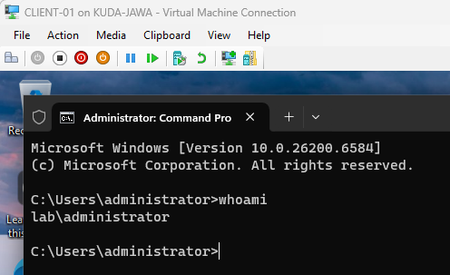
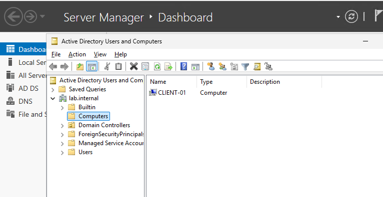

# AD DS Task 1: Building a Multi-VM Forest Core & DNS Subsystem

Difficulty: 🟢 Easy

Primary Tools: Windows Server 2022/2025, Windows 10/11 Enterprise/Pro, Hyper-V Manager, PowerShell

Time to Complete: 2–3 hours

## 🏢 Scenario & Architectural Design

Active Directory Domain Services (AD DS) is the backbone of enterprise identity management. It turns isolated Windows machines into a single managed administrative environment.

In this introductory lab, you are acting as a Systems Administrator setting up an enterprise network from scratch. You will configure Hyper-V networking, provision a **Domain Controller (DC)** running Windows Server, install and promote AD DS, configure DNS properly (the #1 source of AD issues), and join a client machine to the domain.

## 📐 Logical Architecture Diagram (ASCII format)

```text
┌───────────────────────── Host Machine (Your Laptop/PC) ─────────────────────────┐
│                                                                                 │
│   [ Hyper-V Internal Virtual Switch ] ── Subnet: 192.168.10.0/24               │
│               │                                          │                      │
│               ▼                                          ▼                      │
│   ┌─────────────────────────┐                ┌─────────────────────────┐        │
│   │   DC-01 (Windows Server)│                │   CLIENT-01 (Win 10/11) │        │
│   │                         │                │                         │        │
│   │  • Static IP:           │                │  • Static IP:           │        │
│   │    192.168.10.10        │                │    192.168.10.20        │        │
│   │  • Role: AD DS & DNS    │                │  • Role: Domain Client  │        │
│   │  • Domain: corp.local   │ ◄───────────── │  • DNS Target:          │        │
│   │                         │   Domain Join  │    192.168.10.10        │        │
│   └─────────────────────────┘                └─────────────────────────┘        │
│                                                                                 │
└─────────────────────────────────────────────────────────────────────────────────┘

```

---

## 🛠️ The Implementation Requirements

### 1. Networking Setup in Hyper-V

1. Open **Hyper-V Manager** and go to **Virtual Switch Manager**.
2. Create a new **Internal** Virtual Switch named `AD-Lab-Switch`. *(An internal switch allows communication between your VMs and your host machine, but isolated from your main home Wi-Fi).*
3. Create two Virtual Machines:
* **`DC-01`**: Assign 2 CPU cores, 4000 MB RAM (Enable Dynamic Memory), and attach to `AD-Lab-Switch`. Install **Windows Server 2022 or 2025** (Evaluation ISO).
* **`CLIENT-01`**: Assign 2 CPU cores, 4000 MB RAM, and attach to `AD-Lab-Switch`. Install **Windows 10 or 11 Enterprise/Pro**.


### 2. Static IP Addressing & Server Preparation

Active Directory **requires** fixed, static networking parameters.

1. Boot `DC-01`. Change the computer hostname to `DC-01` and restart.
2. Open Network Connections (`ncpa.cpl`) on `DC-01` and configure IPv4 manually:
* **IP Address:** `192.168.10.10`
* **Subnet Mask:** `255.255.255.0`
* **Default Gateway:** *Leave Blank*
* **Preferred DNS Server:** `127.0.0.1` (or `192.168.10.10`)


### 3. AD DS Promotion & Domain Creation

1. Open **Server Manager** on `DC-01` -> Click **Add Roles and Features**.
2. Select **Active Directory Domain Services** (it will automatically select the DNS Server role too). Complete the installation wizard.
3. Click the yellow notification flag in Server Manager and select **Promote this server to a domain controller**.
4. Select **Add a new forest**. Set the Root Domain Name to `corp.local` (or `lab.internal`).
5. Set a Restore Mode Password (DSRM) and finish the wizard. Reboot `DC-01` when prompted.

### 4. Client Machine Preparation & Domain Join

1. Boot `CLIENT-01`. Change its hostname to `CLIENT-01` and restart.
2. Open Network Connections (`ncpa.cpl`) on `CLIENT-01` and set its static IP parameters:
* **IP Address:** `192.168.10.20`
* **Subnet Mask:** `255.255.255.0`
* **Preferred DNS Server:** `192.168.10.10` *(CRITICAL: Point this directly to DC-01's IP, NOT your home router!).*


3. Open **System Properties** (`sysdm.cpl`) on `CLIENT-01`.
4. Click **Change...**, switch from Workgroup to Domain, and type `corp.local`.
5. When prompted for credentials, type `corp\Administrator` and the password you set during Windows Server setup. Restart the client machine.

---

## 🚨 Troubleshooting Inject (Common Pitfall)

### Failure Scenario

When you attempt to join `CLIENT-01` to `corp.local`, you get the following error:

> *"An Active Directory Domain Controller (AD DC) for the domain 'corp.local' could not be contacted."*

### Debugging Actions

1. On `CLIENT-01`, open PowerShell and run: `ping 192.168.10.10`. If pings fail, check Windows Firewall on `DC-01` or verify both VMs are connected to the exact same Hyper-V Virtual Switch.
2. On `CLIENT-01`, run: `nslookup corp.local`.

### Root Cause Hint

If `nslookup` shows your home Wi-Fi router IP (e.g., `192.168.1.1`) or `UnKnown`, your DNS settings on `CLIENT-01` are wrong! Active Directory relies completely on its internal DNS server to find domain controllers. `CLIENT-01` must **only** use `192.168.10.10` as its Preferred DNS.

---

## ✅ Acceptance Criteria & Proof of Success

1. **Domain Logins:** On `CLIENT-01`, log in using the domain credentials (`CORP\Administrator`). Run `whoami` in PowerShell; it should return `corp\administrator`. 
Output: \


2. **Active Directory Verification:** On `DC-01`, open **Active Directory Users and Computers** (`dsa.msc`). Expand `corp.local` -> Click the **Computers** Organizational Unit (OU). You should see `CLIENT-01` listed as an active domain member!
Output: \


Let me know once you've spun up Hyper-V and completed this base task, or if you run into any Hyper-V network issues!
