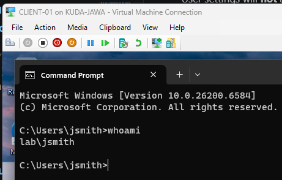
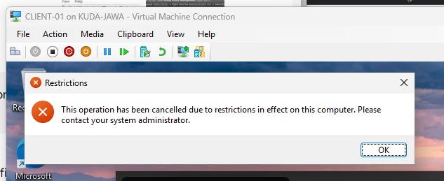
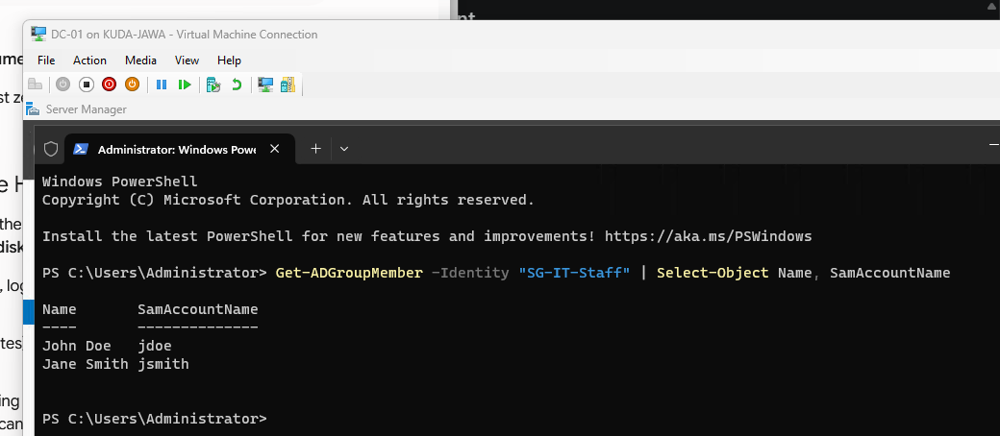

# AD DS Task 2: Organizational Unit (OU) Hierarchy, User Management, and Group Policy Objects (GPOs)

Difficulty: 🟢 Easy

Primary Tools: Windows Server 2022/2025, Windows 10/11, Active Directory Users and Computers (ADUC), Group Policy Management Console (GPMC), PowerShell

Time to Complete: 2 hours

---

## 🏢 Scenario & Architectural Design

Now that your domain (`corp.local`) is running and `CLIENT-01` is joined, it’s time to structure your directory. In real-world enterprises, administrators never manage users in the default "Users" container, nor do they apply settings manually to individual PCs.

Instead, companies build a clean **Organizational Unit (OU)** structure matching their business departments (e.g., IT, HR, Finance). They use **Security Groups** to grant access to resources, and **Group Policy Objects (GPOs)** to automatically configure security settings, map drives, or enforce desktop restrictions across hundreds of workstations.

In this lab, you will act as a SysAdmin building an enterprise OU structure, provisioning users and groups manually and via PowerShell, and deploying GPOs to customize and secure your domain clients automatically upon reboot.

---

## 📐 Logical Architecture Diagram (ASCII format)

```text
┌─────────────────────────────────────────────────────────────────────────┐
│ Domain: corp.local (DC-01)                                              │
│                                                                         │
│  └── 📁 CORP-Company (Top-Level OU)                                     │
│       │                                                                 │
│       ├── 📁 IT-Department                                              │
│       │    ├── 👤 User: John Doe (jdoe)                                 │
│       │    └── 👥 Group: SG-IT-Staff                                    │
│       │                                                                 │
│       └── 📁 Workstations (OU containing CLIENT-01)                      │
│            │                                                            │
│            └── 📜 Applied GPO: "GPO_Enforce_Security_Defaults"          │
│                 ├── Disables Control Panel for non-IT users             │
│                 ├── Configures a custom Desktop Wallpaper               │
│                 └── Sets Account Lockout Policy (3 invalid attempts)    │
│                                                                         │
└─────────────────────────────────────────────────────────────────────────┘

```

---

## 🛠️ The Implementation Requirements

### 1. Designing the OU & Security Group Hierarchy

1. On `DC-01`, open **Active Directory Users and Computers** (`dsa.msc`).
2. Create a top-level OU named `CORP-Company`.
3. Inside `CORP-Company`, create two sub-OUs:
* `IT-Department`
* `Workstations`


4. Move `CLIENT-01` from the default `Computers` container into your new `CORP-Company -> Workstations` OU.
5. Inside the `IT-Department` OU, create a **Global Security Group** named `SG-IT-Staff`.

---

### 2. User Provisioning (Manual & PowerShell Automation)

To practice enterprise administration, create users using both GUI and automation:

1. **GUI Provisioning:** Inside `IT-Department`, manually create a user:
* **First Name:** John | **Last Name:** Doe
* **User Logon Name:** `jdoe`
* **Password:** Set a complex password (e.g., `P@ssw0rd2026!`) and check *"Password never expires"* for testing.
* Add `jdoe` as a member of `SG-IT-Staff`.


2. **PowerShell Provisioning:** Open PowerShell as Administrator on `DC-01` and write/run a script to automate creating a second user inside the `IT-Department` OU:
```powershell
$Password = ConvertTo-SecureString "P@ssw0rd2026!" -AsPlainText -Force
New-ADUser -Name "Jane Smith" `
           -GivenName "Jane" `
           -Surname "Smith" `
           -SamAccountName "jsmith" `
           -UserPrincipalName "jsmith@corp.local" `
           -Path "OU=IT-Department,OU=CORP-Company,DC=corp,DC=local" `
           -AccountPassword $Password `
           -Enabled $true `
           -PasswordNeverExpires $true

Add-ADGroupMember -Identity "SG-IT-Staff" -Members "jsmith"

```


---

### 3. Creating & Applying Group Policy Objects (GPOs)

1. On `DC-01`, open **Group Policy Management** (`gpmc.msc`).
2. Expand `corp.local` -> Right-click the `Workstations` OU -> Select **Create a GPO in this domain, and Link it here...**.
3. Name the GPO: `GPO_Enforce_Security_Defaults`.
4. Right-click the newly created GPO and click **Edit...** to configure two policies:
* **Setting A: Account Lockout Policy (Computer Configuration)**
* Navigate to: `Computer Configuration -> Policies -> Windows Settings -> Security Settings -> Account Policies -> Account Lockout Policy`
* Set **Account lockout threshold** to `3 invalid logon attempts`.


* **Setting B: Restrict Control Panel Access (User Configuration)**
* Navigate to: `User Configuration -> Policies -> Administrative Templates -> Control Panel`
* Enable **Prohibit access to Control Panel and PC settings**.


---

## 🚨 Operational Troubleshooting Inject (Live Fire Exercise)

### Failure Scenario

You log into `CLIENT-01` as `corp\jsmith`, but Control Panel is still accessible, and typing `3` wrong passwords doesn't lock out the user account. The GPO isn't applying!

### Debugging Actions & Commands

Log into `CLIENT-01` and run these commands in PowerShell:

1. Force a Group Policy update manually:
```powershell
gpupdate /force

```


2. Generate a Group Policy Result report to see what GPOs are reaching the machine:
```powershell
gpresult /r

```


### Root Cause Hint

Check where your GPO is linked in `gpmc.msc`. If you put User settings inside a GPO linked to an OU that **only contains Computer objects** (like `Workstations`), the User settings will **not** apply by default unless **Loopback Processing** is enabled, OR unless the user account itself lives in an OU where that GPO is linked! Ensure your GPO targets the correct OU or link it at the top `CORP-Company` level.

---

## ✅ Acceptance Criteria & Proof of Success

1. **User Login Verification:** Log into `CLIENT-01` using `corp\jsmith`. Open PowerShell and run `whoami`. It should return `corp\jsmith`.
Output: \


2. **Policy Enforcement Verification:** On `CLIENT-01`, try to open Settings or Control Panel. Windows should block access with an administrative restriction error message.
output: \


3. **PowerShell Verification:** On `DC-01`, run this command in PowerShell to verify `SG-IT-Staff` group membership:
```powershell
Get-ADGroupMember -Identity "SG-IT-Staff" | Select-Object Name, SamAccountName

```
*Output must show both `jdoe` and `jsmith`.*
Output: \
